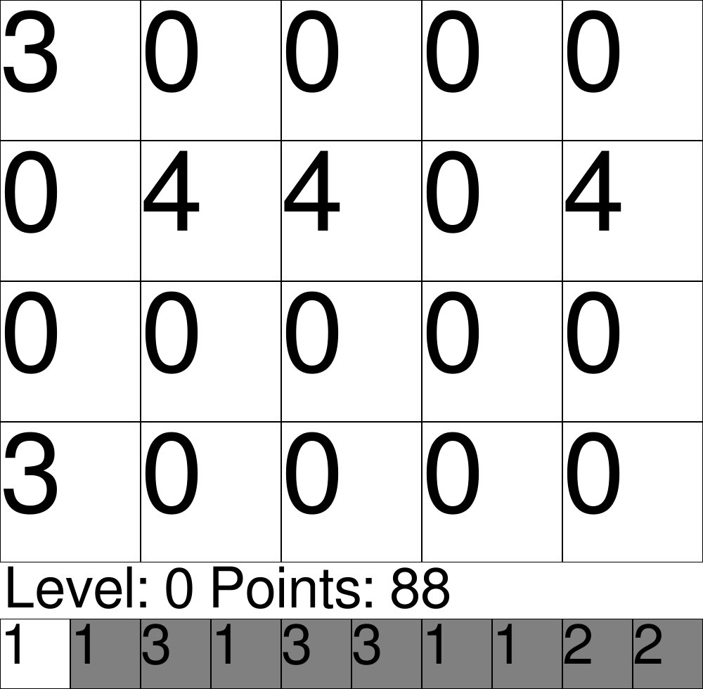

# Block Add Game
A small Puzzle Game written in Python using Pygame.

## How to play
You get a block from the queue and you have to place it on the field. If the block gets grouped with 3 or more touching Blocks of the same type, the will be merged to a Block of a higher tier.
When Blocks get merged together, you will receive points for the amount and the value. 
If you group for example 3 Blocks of the weight 2, they will give you 6 Points. (2+2+2)

